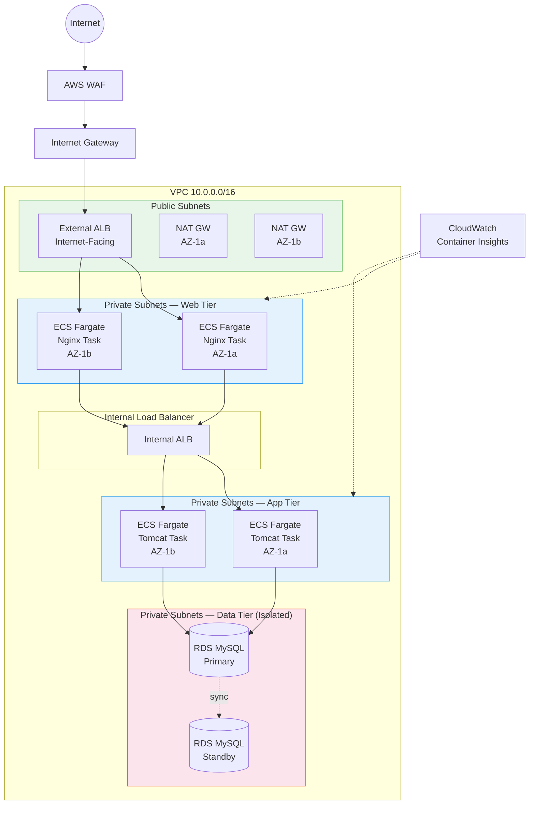

# Production-Grade AWS ECS Fargate 3-Tier Architecture with Auto Scaling — Terraform

  

Enterprise-grade, fully automated AWS infrastructure for deploying a Java-based web application using a secure, scalable, and highly available 3-tier ECS Fargate architecture — provisioned entirely with Terraform.

---

## Architecture Overview



```
                         ┌──────────────┐
                         │  CloudFront   │ (Optional CDN)
                         └──────┬───────┘
                                │
                         ┌──────▼───────┐
                         │   AWS WAF     │
                         └──────┬───────┘
                                │
                    ┌───────────▼───────────┐
                    │  Internet Gateway (IGW)│
                    └───────────┬───────────┘
                                │
          ┌─────────────────────┼─────────────────────┐
          │              Public Subnets                │
          │        ┌──────────────────┐               │
          │        │   External ALB    │               │
          │        │(Internet-Facing)  │               │
          │        └──────┬───────────┘               │
          └───────────────┼───────────────────────────┘
                          │
          ┌───────────────▼───────────────────────────┐
          │       Private Subnets (Web Tier)           │
          │                                            │
          │  ┌──── AZ: us-east-1a ────┐  ┌──── AZ: us-east-1b ────┐
          │  │  ┌──────────────────┐  │  │  ┌──────────────────┐  │
          │  │  │ ECS Fargate Task │  │  │  │ ECS Fargate Task │  │
          │  │  │   (Nginx)        │  │  │  │   (Nginx)        │  │
          │  │  └────────┬─────────┘  │  │  └────────┬─────────┘  │
          │  └───────────┼────────────┘  └───────────┼────────────┘
          └──────────────┼───────────────────────────┼─┘
                         │                           │
               ┌─────────▼───────────────────────────▼──┐
               │          Internal ALB                   │
               └─────────┬───────────────────────────┬──┘
                         │                           │
          ┌──────────────▼────────────┐  ┌───────────▼─────────────┐
          │  Private Subnets (App)    │  │  Private Subnets (App)  │
          │  ┌──────────────────┐     │  │  ┌──────────────────┐   │
          │  │ ECS Fargate Task │     │  │  │ ECS Fargate Task │   │
          │  │   (Tomcat)       │     │  │  │   (Tomcat)       │   │
          │  └────────┬─────────┘     │  │  └────────┬─────────┘   │
          └───────────┼───────────────┘  └───────────┼─────────────┘
                      │                              │
          ┌───────────▼──────────────────────────────▼──┐
          │       Private Subnets (Data — Isolated)     │
          │  ┌──────────────┐      ┌──────────────┐     │
          │  │ RDS MySQL    │      │ RDS MySQL    │     │
          │  │ (Primary)    │      │ (Standby)    │     │
          │  └──────────────┘      └──────────────┘     │
          └─────────────────────────────────────────────┘
```

---

## Project Overview

### Executive Summary

The project deploys a **production-grade Java-based web application** on AWS leveraging a secure, scalable, and highly available 3-tier **ECS Fargate** architecture.

The solution is designed to:

- Ensure high availability across multiple Availability Zones
- Enable dynamic scalability using ECS Service Auto Scaling
- Enforce security best practices across all layers
- Eliminate server management with serverless containers (Fargate)
- Integrate CI/CD pipelines for automated container deployments

> The solution adopts a multi-tier architecture with clear separation of presentation, application, and data layers, ensuring modular scalability and fault isolation.

### Three Tiers

| Tier | Component | Subnet | Scaling |
|------|-----------|--------|---------|
| Presentation | Nginx (ECS Fargate) | Private | ECS Auto Scaling (1–6 tasks) |
| Application | Apache Tomcat (ECS Fargate) | Private | ECS Auto Scaling (1–6 tasks) |
| Data | Amazon RDS MySQL (Multi-AZ) | Private (Isolated) | Vertical + Read Replicas |

---

## Key Features

- **Serverless Containers** — ECS Fargate eliminates EC2 instance management, patching, and capacity planning
- **High Availability** — Multi-AZ deployment across us-east-1a and us-east-1b with automated failover
- **Auto Scaling** — Target-tracking scaling policies based on CPU utilization for both web and app services
- **Defense-in-Depth Security** — Security Groups, NACLs, IAM least-privilege roles, VPC Flow Logs, WAF, and encryption
- **Infrastructure as Code** — 100% Terraform-managed, modular, reusable, and version-controlled
- **ECS Exec for Debugging** — Replaces bastion/SSH with secure container exec via AWS SSM
- **Deployment Safety** — Circuit breaker with automatic rollback on failed deployments
- **Observability** — CloudWatch Container Insights, alarms, dashboard, and centralized log aggregation
- **Cost Optimized** — Pay only for container resources consumed, no idle EC2 instances

---

## Project Structure

```
production-grade-aws-ecs-autoscaling-terraform/
├── modules/
│   ├── vpc/                    # VPC, Subnets, IGW, NAT, Route Tables
│   ├── security/               # Security Groups, NACLs, ECS IAM Roles
│   ├── alb/                    # Application Load Balancers (External + Internal)
│   ├── ecs/                    # ECS Cluster, Task Definitions, Services, Auto Scaling
│   ├── rds/                    # RDS MySQL Multi-AZ, Secrets Manager
│   ├── monitoring/             # CloudWatch Dashboard, Alarms, SNS
│   └── waf/                    # AWS WAF Rules and Web ACL
├── environments/
│   ├── dev/                    # Dev environment tfvars
│   ├── staging/                # Staging environment tfvars
│   └── prod/                   # Production environment tfvars
├── docs/                       # Architecture diagrams, references
├── main.tf                     # Root module composition
├── variables.tf                # Input variables
├── outputs.tf                  # Output values
├── providers.tf                # AWS provider configuration
├── backend.tf                  # S3 + DynamoDB remote state
├── .gitignore
├── LICENSE
└── README.md
```

### Module Responsibilities

| Module | Files | What It Provisions |
|--------|-------|-------------------|
| `modules/vpc/` | 3 | VPC, 8 subnets, IGW, 2 NAT GWs, route tables |
| `modules/security/` | 3 | 5 Security Groups, NACLs per tier, ECS execution + task IAM roles |
| `modules/alb/` | 3 | External ALB + Internal ALB, target groups (IP type), health checks |
| `modules/ecs/` | 3 | ECS Cluster, Fargate task definitions, services, auto scaling policies |
| `modules/rds/` | 3 | RDS MySQL Multi-AZ, Secrets Manager, subnet group |
| `modules/monitoring/` | 3 | SNS topic, CloudWatch alarms (ECS/RDS/ALB), dashboard |
| `modules/waf/` | 3 | WAF Web ACL with rate limiting + AWS managed rules |

---

## Network Deep Dive

### VPC Structure

```
VPC: 10.0.0.0/16 (65,536 IP addresses)
│
├── Public Subnets (internet-accessible)
│   ├── 10.0.1.0/24 (AZ-1a) — NAT GW, External ALB
│   └── 10.0.2.0/24 (AZ-1b) — NAT GW, External ALB
│
├── Private Web Subnets (ECS Fargate Nginx — no public IP)
│   ├── 10.0.11.0/24 (AZ-1a)
│   └── 10.0.12.0/24 (AZ-1b)
│
├── Private App Subnets (ECS Fargate Tomcat — no public IP)
│   ├── 10.0.21.0/24 (AZ-1a)
│   └── 10.0.22.0/24 (AZ-1b)
│
└── Private DB Subnets (RDS — FULLY ISOLATED, no internet at all)
    ├── 10.0.31.0/24 (AZ-1a)
    └── 10.0.32.0/24 (AZ-1b)
```

### Why 8 Subnets?

Each tier gets its own subnet pair (one per AZ) because:

- **Isolation**: Different NACLs per tier
- **Blast radius**: If web tier is compromised, app/db subnets have separate firewall rules
- **Compliance**: Many audits require network-level separation between tiers
- **Independent scaling**: Each tier can grow without IP conflicts

### Route Tables — Who Can Reach What?

```
Public Route Table:
  10.0.0.0/16  → local (VPC internal)
  0.0.0.0/0    → Internet Gateway         ← Makes it "public"

Private Route Table (AZ-1a):
  10.0.0.0/16  → local (VPC internal)
  0.0.0.0/0    → NAT Gateway (AZ-1a)      ← Can reach internet for image pulls,
                                              but internet CANNOT reach back in

Private Route Table (AZ-1b):
  10.0.0.0/16  → local (VPC internal)
  0.0.0.0/0    → NAT Gateway (AZ-1b)      ← Separate NAT GW for HA

DB Route Table:
  10.0.0.0/16  → local (VPC internal)     ← THAT'S IT. No internet route.
                                              DB can only talk within the VPC.
```

**Why 2 NAT Gateways?** If you use one NAT GW in AZ-1a and that AZ goes down, all Fargate tasks in AZ-1b lose internet access (can't pull images, can't push CloudWatch metrics). With one per AZ, each AZ is self-sufficient.

**Why DB has no NAT route?** The database should NEVER need to reach the internet. It only needs to talk to Tomcat containers within the VPC. Even if someone compromises the DB, they can't exfiltrate data to the internet.

---

## Complete Traffic Flow (Step by Step)

Understanding how a user request travels through the entire infrastructure:

```
Step 1: User types the URL in browser
        ↓
Step 2: DNS resolves to External ALB's public IP
        ↓
Step 3: AWS WAF inspects the request FIRST
        - Is this IP sending > 2000 requests/5min? → BLOCK (rate limiting)
        - Does the request contain SQL injection patterns? → BLOCK
        - Does it match known bad input patterns? → BLOCK
        - Clean request? → ALLOW, pass to ALB
        ↓
Step 4: External ALB (internet-facing, lives in PUBLIC subnet)
        - Receives the request on port 80
        - Runs health check: "Is Nginx healthy?"
        - Picks a healthy Nginx task using round-robin
        - Forwards request to Nginx container on port 80
        ↓
Step 5: Nginx (ECS Fargate task in PRIVATE web subnet — NO public IP)
        - Receives request from ALB
        - Adds security headers:
          • X-Frame-Options: SAMEORIGIN (prevents clickjacking)
          • X-Content-Type-Options: nosniff (prevents MIME sniffing)
          • X-XSS-Protection: 1; mode=block
        - Acts as reverse proxy → forwards to Internal ALB on port 8080
        ↓
Step 6: Internal ALB (lives in PRIVATE app subnet)
        - Receives request from Nginx
        - Picks a healthy Tomcat task
        - Forwards to Tomcat container on port 8080
        ↓
Step 7: Tomcat (ECS Fargate task in PRIVATE app subnet — NO public IP)
        - Java/Spring Boot app processes the request
        - Needs data? Connects to RDS on port 3306
        ↓
Step 8: RDS MySQL (lives in ISOLATED private subnet — NO internet at all)
        - Processes the SQL query
        - Returns data to Tomcat
        ↓
Step 9: Response travels back:
        RDS → Tomcat → Internal ALB → Nginx → External ALB → User
```

> At no point does the user's request directly touch Nginx, Tomcat, or RDS. Everything goes through load balancers. This is the defense-in-depth model.

---

## Security Deep Dive

### Security Group Chain (The Trust Chain)

Each SG only allows traffic from the previous tier's SG:

```
                    ┌─────────────────────────────────────────────┐
                    │         SECURITY GROUP CHAIN                │
                    │                                             │
  Internet ──80/443──→ [External ALB SG]                         │
                    │       │                                     │
                    │       ├──80──→ [Web SG] (Nginx Fargate)     │
                    │       │           │                         │
                    │       │           ├──8080──→ [Internal ALB SG]
                    │       │           │              │          │
                    │       │           │              ├──8080──→ [App SG] (Tomcat Fargate)
                    │       │           │              │              │
                    │       │           │              │              ├──3306──→ [DB SG] (RDS)
                    │       │           │              │              │
                    └─────────────────────────────────────────────┘
```

### Security Group Rules Explained

**External ALB SG:**

| Direction | Port | Source | Why |
|-----------|------|--------|-----|
| Inbound | 80 (HTTP) | 0.0.0.0/0 | Must accept traffic from entire internet |
| Inbound | 443 (HTTPS) | 0.0.0.0/0 | Must accept traffic from entire internet |
| Outbound | All | 0.0.0.0/0 | Forwards to Nginx |

**Web SG (Nginx Fargate):**

| Direction | Port | Source | Why |
|-----------|------|--------|-----|
| Inbound | 80 | External ALB SG | HTTP only from ALB — NOT from internet directly |
| Outbound | All | 0.0.0.0/0 | Forwards to Internal ALB, pulls images |

**Internal ALB SG:**

| Direction | Port | Source | Why |
|-----------|------|--------|-----|
| Inbound | 8080 | Web SG | Only Nginx can send traffic here |
| Outbound | All | 0.0.0.0/0 | Forwards to Tomcat |

**App SG (Tomcat Fargate):**

| Direction | Port | Source | Why |
|-----------|------|--------|-----|
| Inbound | 8080 | Internal ALB SG | Only Internal ALB can reach Tomcat |
| Outbound | All | 0.0.0.0/0 | Connects to RDS, pushes CloudWatch metrics |

**DB SG (RDS):**

| Direction | Port | Source | Why |
|-----------|------|--------|-----|
| Inbound | 3306 | App SG only | ONLY Tomcat can talk to the database |
| Outbound | All | VPC only | No internet route — responses stay within VPC |

### What Happens If Nginx Is Compromised?

- Attacker can reach Internal ALB on 8080 — that's it
- They CANNOT reach RDS (DB SG only allows from App SG)
- They CANNOT access Tomcat directly (App SG only allows from Internal ALB SG)
- The blast radius is contained to the web tier

### NACLs (Network ACLs) — Second Layer of Defense

NACLs are stateless firewalls at the subnet level (SGs are stateful):

**Web NACL:**
```
Inbound:
  Rule 100: Allow TCP 80 from VPC CIDR (HTTP from ALB)
  Rule 200: Allow TCP 1024-65535 from 0.0.0.0/0 (return traffic)
Outbound:
  Rule 100: Allow ALL outbound
```

**App NACL:**
```
Inbound:
  Rule 100: Allow TCP 8080 from VPC CIDR (Tomcat from Internal ALB)
  Rule 200: Allow TCP 1024-65535 from 0.0.0.0/0 (return traffic)
Outbound:
  Rule 100: Allow ALL outbound
```

**DB NACL (Most Restrictive):**
```
Inbound:
  Rule 100: Allow TCP 3306 from VPC CIDR (MySQL from App tier)
  Rule 200: Allow TCP 1024-65535 from VPC CIDR (return traffic)
Outbound:
  Rule 100: Allow TCP 1024-65535 to VPC CIDR ONLY (responses back)
```

> **Why both SGs AND NACLs?** Defense in depth. If someone misconfigures a Security Group, the NACL is still there as a safety net. NACLs are evaluated BEFORE SGs.

### IAM Roles (Least Privilege)

| Role | Purpose | Permissions |
|------|---------|-------------|
| ECS Execution Role | Pull images, write logs | `AmazonECSTaskExecutionRolePolicy` |
| ECS Task Role | Runtime container permissions | SSM Messages (for ECS Exec) |

### Additional Security Measures

| Measure | Implementation | Why |
|---------|---------------|-----|
| ECS Exec | Replaces SSH/Bastion entirely | Secure container access via SSM — no open ports |
| RDS Encryption | `storage_encrypted = true` | Database data encrypted with AWS KMS |
| Secrets Manager | Auto-generated DB password | Credentials never in code or Terraform state |
| WAF | Rate limiting + managed rule sets | Blocks SQL injection, bad bots, DDoS attempts |
| Container Insights | `containerInsights = enabled` | Deep visibility into container performance |
| Deployment Circuit Breaker | `enable = true, rollback = true` | Auto-rollback on failed deployments |

---

## ECS Auto Scaling Deep Dive

### How Scaling Works

```
Normal Load              High Load (CPU > 70%)         Low Load (CPU < 30%)
┌──────────┐             ┌──────────┐                  ┌──────────┐
│  Task 1  │             │  Task 1  │                  │  Task 1  │
├──────────┤             ├──────────┤                  ├──────────┤
│  Task 2  │             │  Task 2  │                  │  Task 2  │
└──────────┘             ├──────────┤                  └──────────┘
min=2, desired=2         │  Task 3  │ ← NEW            desired=2 (back to min)
                         └──────────┘   (scale out)    Task 3 stopped
```

### Scaling Policy Details

| Parameter | Value | Explanation |
|-----------|-------|-------------|
| Policy Type | Target Tracking | AWS manages scale-out AND scale-in automatically |
| Metric | ECSServiceAverageCPUUtilization | Average CPU across all tasks in the service |
| Target Value | 70% | AWS adds tasks when above, removes when well below |
| Scale Out Cooldown | 60 seconds | Fast response to traffic spikes |
| Scale In Cooldown | 300 seconds (5 min) | Prevents rapid oscillation |
| Min Tasks | 2 (prod) | Always running for HA |
| Max Tasks | 6 | Cost ceiling |

### Why Target Tracking over Simple Scaling?

- **Simple Scaling** (old ASG approach): You define separate scale-out and scale-in alarms manually
- **Target Tracking** (ECS approach): You say "keep CPU at 70%" and AWS handles everything — creates alarms, calculates how many tasks to add/remove, manages cooldowns

### Deployment Circuit Breaker

```
Deploy new task definition version
  ↓
ECS starts new tasks with new image
  ↓
Health check passes? → Continue rolling deployment
Health check FAILS?  → Circuit breaker triggers → Auto-rollback to previous version
```

No manual intervention needed. Failed deployments are automatically reverted.

---

## Database Deep Dive

### Multi-AZ — How Failover Works

```
Normal Operation:
┌─────────────────┐     ┌─────────────────┐
│   AZ: us-east-1a│     │   AZ: us-east-1b│
│  ┌───────────┐  │     │  ┌───────────┐  │
│  │ RDS MySQL │  │────→│  │ RDS MySQL │  │
│  │ (PRIMARY) │  │sync │  │ (STANDBY) │  │
│  │ Read+Write│  │     │  │  No access │  │
│  └───────────┘  │     │  └───────────┘  │
└─────────────────┘     └─────────────────┘

After AZ-1a Failure (automatic, ~60 seconds):
┌─────────────────┐     ┌─────────────────┐
│   AZ: us-east-1a│     │   AZ: us-east-1b│
│  ┌───────────┐  │     │  ┌───────────┐  │
│  │    DOWN    │  │     │  │ RDS MySQL │  │
│  │           │  │     │  │ (PRIMARY) │  │ ← Promoted automatically
│  │           │  │     │  │ Read+Write│  │
│  └───────────┘  │     │  └───────────┘  │
└─────────────────┘     └─────────────────┘
```

The DNS endpoint stays the same — your app doesn't need any code change. AWS flips the DNS to point to the new primary.

### RDS Configuration

| Setting | Value | Why |
|---------|-------|-----|
| Engine | MySQL 8.0 | Latest stable, full Unicode (utf8mb4) |
| Storage | gp3, 20GB initial | Latest gen SSD, auto-scales up to 100GB |
| Backup Window | 03:00-04:00 UTC | Low traffic period |
| Maintenance Window | Mon 04:00-05:00 UTC | Patches applied during low traffic |

### Prod vs Dev/Staging Differences

| Feature | Prod | Dev/Staging |
|---------|------|-------------|
| Deletion protection | Enabled | Disabled |
| Final snapshot | Taken before destroy | Skipped |
| Backup retention | 7 days | 1-3 days |
| Instance class | db.t3.medium | db.t3.micro |

---

## Load Balancer Deep Dive

### Why TWO ALBs?

```
Option A (Bad):  External ALB → Tomcat directly
  Problem: Tomcat exposed to raw internet traffic. No reverse proxy.
           No security headers. No static content caching.

Option B (Good): External ALB → Nginx → Internal ALB → Tomcat
  Benefit: Nginx adds security headers, can cache static content,
           can do SSL termination, rate limiting at app level.
           Internal ALB distributes across Tomcat tasks.
           Clear separation of concerns.
```

### External ALB (Internet-Facing)

```
Listener: Port 80 (HTTP)
  → Default Action: Forward to Web Target Group

Web Target Group:
  - Protocol: HTTP, Port: 80
  - Target Type: IP (required for Fargate awsvpc networking)
  - Targets: Nginx task IPs (registered by ECS automatically)
  - Health Check:
      Path: /
      Interval: 30 seconds
      Healthy threshold: 3 consecutive successes
      Unhealthy threshold: 3 consecutive failures
      Timeout: 5 seconds
```

- `drop_invalid_header_fields = true` — Prevents HTTP request smuggling attacks
- Deletion protection enabled in prod — prevents accidental `terraform destroy`

### Internal ALB

- `internal = true` — No public IP, only accessible within VPC
- Listens on port 8080, forwards to Tomcat target group
- Same health check configuration as external ALB

---

## WAF Deep Dive

The WAF sits in front of the External ALB with 4 rules:

| Priority | Rule | What It Does |
|----------|------|--------------|
| 1 | Rate Limiting | Blocks any IP sending > 2000 requests in 5 minutes |
| 2 | AWS Common Rule Set | Blocks known exploits (path traversal, bad bots, etc.) |
| 3 | SQL Injection Rule Set | Blocks SQL injection patterns in query strings, body, headers |
| 4 | Known Bad Inputs | Blocks requests with known malicious patterns (Log4j, etc.) |

All rules have CloudWatch metrics enabled + sampled requests for debugging.

---

## Monitoring Deep Dive

### CloudWatch Alarms

| Alarm | Threshold | Action |
|-------|-----------|--------|
| ECS Web CPU High | > 85% for 10 min | SNS email notification |
| ECS Web Memory High | > 85% for 10 min | SNS email notification |
| ECS App CPU High | > 85% for 10 min | SNS email notification |
| ECS App Memory High | > 85% for 10 min | SNS email notification |
| RDS CPU High | > 80% for 10 min | SNS email notification |
| RDS Low Storage | < 5 GB free | SNS email notification |
| ALB 5xx Errors | > 10 in 5 min | SNS email notification |

### CloudWatch Dashboard

Pre-built dashboard with 6 real-time widgets:

- ECS Web — CPU Utilization
- ECS App — CPU Utilization
- ECS Web — Memory Utilization
- ECS App — Memory Utilization
- RDS CPU Utilization
- RDS Free Storage Space

### Log Groups

```
/ecs/<project>-<env>/web         ← Nginx container logs
/ecs/<project>-<env>/app         ← Tomcat container logs
```

### Container Insights

Enabled at cluster level — provides:
- Task-level CPU/Memory/Network metrics
- Service-level aggregated metrics
- Automatic anomaly detection

---

## Prerequisites

| Tool | Version | Purpose |
|------|---------|---------|
| Terraform | >= 1.5 | Infrastructure provisioning |
| AWS CLI | v2 | AWS authentication and interaction |
| Docker | Latest | Build container images |
| Git | Latest | Version control |
| AWS Account | — | With IAM user having programmatic access |

### AWS Credentials Setup

```bash
aws configure
# AWS Access Key ID: <your-access-key>
# AWS Secret Access Key: <your-secret-key>
# Default region: us-east-1
# Default output format: json
```

---

## Quick Start

```bash
# 1. Clone the repository
git clone https://github.com/arbindmahato/production-grade-aws-ecs-autoscaling-terraform.git
cd production-grade-aws-ecs-autoscaling-terraform

# 2. Initialize Terraform
terraform init

# 3. Review the execution plan
terraform plan -var-file=environments/prod/terraform.tfvars

# 4. Apply the infrastructure
terraform apply -var-file=environments/prod/terraform.tfvars

# 5. Access your application
curl http://$(terraform output -raw external_alb_dns)

# 6. Debug containers via ECS Exec (replaces SSH)
aws ecs execute-command \
  --cluster $(terraform output -raw ecs_cluster_name) \
  --service $(terraform output -raw web_service_name) \
  --task <task-id> \
  --container nginx \
  --interactive \
  --command /bin/sh

# 7. Destroy when done (careful in production!)
terraform destroy -var-file=environments/prod/terraform.tfvars
```

---

## Environment Configuration

Three environments with different sizing:

| Setting | Dev | Staging | Prod |
|---------|-----|---------|------|
| VPC CIDR | 10.2.0.0/16 | 10.1.0.0/16 | 10.0.0.0/16 |
| Web Tasks | 1–2 tasks | 1–3 tasks | 2–6 tasks |
| App Tasks | 1–2 tasks | 1–3 tasks | 2–6 tasks |
| Web CPU/Memory | 256/512 | 256/512 | 512/1024 |
| App CPU/Memory | 256/512 | 512/1024 | 1024/2048 |
| RDS Instance | db.t3.micro | db.t3.micro | db.t3.medium |
| Backup Retention | 1 day | 3 days | 7 days |
| Deletion Protection | No | No | Yes |

Deploy any environment:

```bash
terraform apply -var-file=environments/dev/terraform.tfvars
terraform apply -var-file=environments/staging/terraform.tfvars
terraform apply -var-file=environments/prod/terraform.tfvars
```

### What You Need to Change Before Deploying

1. Update `backend.tf` with your actual S3 bucket name for remote state
2. Replace container images with your ECR URLs (or use defaults for testing)

---

## Container Images

Replace the default images in your tfvars with your ECR repository URLs:

```hcl
web_container_image = "<account-id>.dkr.ecr.us-east-1.amazonaws.com/ecommerce-nginx:latest"
app_container_image = "<account-id>.dkr.ecr.us-east-1.amazonaws.com/ecommerce-app:latest"
```

Default images for testing:
- **Web Tier**: `nginx:latest`
- **App Tier**: `tomcat:11-jdk21`

---

## Day-to-Day Operations

### ECS Exec (Replaces SSH/Bastion)

```bash
# Exec into Nginx container
aws ecs execute-command \
  --cluster ecommerce-prod-cluster \
  --service ecommerce-prod-web \
  --task <task-id> \
  --container nginx \
  --interactive \
  --command /bin/sh

# Exec into Tomcat container
aws ecs execute-command \
  --cluster ecommerce-prod-cluster \
  --service ecommerce-prod-app \
  --task <task-id> \
  --container tomcat \
  --interactive \
  --command /bin/bash
```

### Health Checks

```bash
# Test ALB endpoint
curl -I http://$(terraform output -raw external_alb_dns)

# Check ECS service status
aws ecs describe-services \
  --cluster ecommerce-prod-cluster \
  --services ecommerce-prod-web ecommerce-prod-app
```

### Scaling Operations

```bash
# View current task count
aws ecs describe-services --cluster ecommerce-prod-cluster --services ecommerce-prod-web \
  --query 'services[0].{desired:desiredCount,running:runningCount,pending:pendingCount}'

# Force new deployment (rolling update)
aws ecs update-service --cluster ecommerce-prod-cluster --service ecommerce-prod-web --force-new-deployment
```

### Database Operations

```bash
# Retrieve DB credentials from Secrets Manager
aws secretsmanager get-secret-value --secret-id ecommerce-prod-db-password
```

### Validation

```bash
# Verify Terraform configuration
terraform validate

# Format check
terraform fmt -check -recursive

# Security scan with tfsec
tfsec .

# Cost estimation with Infracost
infracost breakdown --path .
```

---

## Troubleshooting

| Issue | Command | Resolution |
|-------|---------|------------|
| Tasks not starting | `aws ecs describe-tasks --cluster <cluster> --tasks <task-id>` | Check `stoppedReason` — usually image pull failure or IAM permissions |
| ALB health check failing | `aws elbv2 describe-target-health --target-group-arn <arn>` | Verify container is listening on correct port, SG allows ALB |
| Can't pull images | Check NAT Gateway + ECR permissions | Ensure execution role has `AmazonECSTaskExecutionRolePolicy` |
| ECS Exec not working | `aws ecs execute-command ...` | Verify task role has SSM permissions, service has `enableExecuteCommand` |
| Service not scaling | `aws application-autoscaling describe-scaling-activities --service-namespace ecs` | Check scaling policy target value and cooldowns |
| High memory usage | CloudWatch Container Insights | Increase task memory in tfvars, redeploy |
| 502 Bad Gateway | `aws logs get-log-events --log-group-name /ecs/<project>/app` | Check Tomcat container logs for startup errors |

---

## Estimated Monthly Cost

| Resource | Specification | Est. Cost (USD) |
|----------|--------------|-----------------|
| ECS Fargate (Web) | 2 tasks x 0.5 vCPU / 1GB | ~$30 |
| ECS Fargate (App) | 2 tasks x 1 vCPU / 2GB | ~$60 |
| ALB (External + Internal) | 2x ALB | ~$35 |
| RDS MySQL | db.t3.medium, Multi-AZ | ~$70 |
| NAT Gateway | 2x (per AZ) | ~$65 |
| CloudWatch | Metrics + Logs + Insights | ~$15 |
| S3 (State + Logs) | Minimal storage | ~$2 |
| **Total** | | **~$277/month** |

Use [AWS Pricing Calculator](https://calculator.aws/) for precise estimates based on your workload.

---

## Implementation Approach

The implementation is executed in structured phases:

**Phase 1: Network and Foundation Setup**

- Provision Virtual Private Cloud (VPC) with 10.0.0.0/16 CIDR
- Configure 8 subnets across 2 Availability Zones (public, web, app, db)
- Attach Internet Gateway and configure 2 NAT Gateways (one per AZ)
- Establish route tables with proper network segmentation

**Phase 2: Security Configuration**

- Define Security Groups with chained trust model (ALB → Web → Internal ALB → App → DB)
- Configure Network ACLs per tier as secondary defense layer
- Create ECS Execution Role (image pulls, log writes)
- Create ECS Task Role with SSM permissions for ECS Exec

**Phase 3: Load Balancing**

- Deploy internet-facing External ALB in public subnets
- Deploy internal ALB in app subnets
- Configure target groups with IP target type (required for Fargate)
- Set up health checks with appropriate thresholds

**Phase 4: ECS Fargate Deployment**

- Create ECS Cluster with Container Insights enabled
- Define task definitions for web (Nginx) and app (Tomcat) tiers
- Deploy ECS services with deployment circuit breaker
- Configure awsvpc networking with private subnets

**Phase 5: Auto Scaling**

- Register ECS services as scalable targets
- Configure target-tracking policies on CPU utilization (70% target)
- Set scale-out cooldown (60s) and scale-in cooldown (300s)
- Define min/max task boundaries per environment

**Phase 6: Database Deployment**

- Deploy Amazon RDS MySQL in Multi-AZ configuration
- Store credentials in AWS Secrets Manager (auto-generated)
- Configure automated backups, maintenance windows
- Enable storage encryption with AWS KMS

**Phase 7: Monitoring and Observability**

- Configure CloudWatch alarms for ECS CPU/Memory, RDS, ALB
- Create pre-built CloudWatch dashboard with 6 widgets
- Set up SNS topic for alarm notifications
- Enable Container Insights for deep task-level metrics

**Phase 8: Security Hardening**

- Deploy AWS WAF with rate limiting and managed rule sets
- Enable ALB invalid header field dropping
- Configure deployment circuit breaker for rollback safety
- Enable deletion protection on production resources

---

## Why ECS Fargate over EC2-Based Architecture

| Aspect | EC2 + Auto Scaling | ECS Fargate |
|--------|-------------------|-------------|
| Server Management | You manage OS patching, AMI updates, instance health | AWS manages everything — no servers to maintain |
| Scaling Speed | 2-5 minutes (launch instance + bootstrap) | 30-60 seconds (start container) |
| Cost Model | Pay for full instance even at low utilization | Pay per-second for actual vCPU/memory used |
| Security Surface | Full OS attack surface, SSH access needed | Minimal surface — no SSH, no OS access |
| Deployment | Rolling instance replacement, complex userdata | Task definition update, automatic rolling deployment |
| Debugging | SSH via bastion host | ECS Exec via SSM (no open ports) |
| Capacity Planning | Choose instance types, manage capacity | Specify CPU/memory per task, AWS handles placement |
| Networking | Instance-level ENI | Task-level ENI (awsvpc) — each task gets its own IP |
| Startup Scripts | Userdata bash scripts (fragile, hard to test) | Docker images (reproducible, testable locally) |
| Rollback | Complex — requires ASG instance refresh | Built-in circuit breaker with automatic rollback |

---

## Fargate Task Sizing Guide

### Valid CPU and Memory Combinations

| CPU (units) | Memory (MB) Options | Use Case |
|-------------|-------------------|----------|
| 256 (0.25 vCPU) | 512, 1024, 2048 | Lightweight proxies, sidecars |
| 512 (0.5 vCPU) | 1024, 2048, 3072, 4096 | Web servers (Nginx), small APIs |
| 1024 (1 vCPU) | 2048, 3072, 4096, 5120, 6144, 7168, 8192 | Application servers (Tomcat, Spring Boot) |
| 2048 (2 vCPU) | 4096 – 16384 (1GB increments) | Heavy workloads, batch processing |
| 4096 (4 vCPU) | 8192 – 30720 (1GB increments) | CPU-intensive applications |

### Sizing Recommendations for This Project

| Tier | Environment | CPU | Memory | Rationale |
|------|-------------|-----|--------|-----------|
| Web (Nginx) | Dev | 256 | 512 | Nginx is lightweight, minimal traffic |
| Web (Nginx) | Prod | 512 | 1024 | Handles concurrent connections, security header processing |
| App (Tomcat) | Dev | 256 | 512 | Minimal JVM footprint for testing |
| App (Tomcat) | Prod | 1024 | 2048 | JVM needs heap space (-Xmx1024M), handles concurrent requests |

### How to Right-Size

1. Start with the recommended values above
2. Monitor CPU and Memory utilization in CloudWatch Container Insights
3. If average CPU > 70% consistently — increase CPU units
4. If memory utilization > 80% — increase memory (JVM OOM kills are silent in Fargate)
5. If average CPU < 20% — consider reducing to save cost

---

## CI/CD Integration Guide

This infrastructure is designed to be pipeline-ready. Here's how to integrate:

### Deployment Flow

```
Developer pushes code
  ↓
CI Pipeline (GitHub Actions / Jenkins / CodePipeline)
  ↓
Build Docker image
  ↓
Push to Amazon ECR
  ↓
Update ECS Task Definition (new image tag)
  ↓
ECS Rolling Deployment (automatic)
  ↓
Circuit Breaker monitors health checks
  ↓
Success → New version live
Failure → Automatic rollback to previous version
```

### Sample GitHub Actions Workflow

```yaml
name: Deploy to ECS
on:
  push:
    branches: [main]

jobs:
  deploy:
    runs-on: ubuntu-latest
    steps:
      - uses: actions/checkout@v4

      - name: Configure AWS credentials
        uses: aws-actions/configure-aws-credentials@v4
        with:
          aws-access-key-id: ${{ secrets.AWS_ACCESS_KEY_ID }}
          aws-secret-access-key: ${{ secrets.AWS_SECRET_ACCESS_KEY }}
          aws-region: us-east-1

      - name: Login to Amazon ECR
        id: login-ecr
        uses: aws-actions/amazon-ecr-login@v2

      - name: Build, tag, and push image
        env:
          ECR_REGISTRY: ${{ steps.login-ecr.outputs.registry }}
          IMAGE_TAG: ${{ github.sha }}
        run: |
          docker build -t $ECR_REGISTRY/ecommerce-app:$IMAGE_TAG .
          docker push $ECR_REGISTRY/ecommerce-app:$IMAGE_TAG

      - name: Update ECS service
        run: |
          aws ecs update-service \
            --cluster ecommerce-prod-cluster \
            --service ecommerce-prod-app \
            --force-new-deployment
```

### Blue/Green Deployment (Advanced)

For zero-downtime deployments with instant rollback capability, integrate with AWS CodeDeploy:

1. Create a CodeDeploy application targeting ECS
2. Define two target groups (blue and green)
3. CodeDeploy shifts traffic gradually (10% → 50% → 100%)
4. If alarms fire during shift — automatic rollback to blue

---

## Disaster Recovery and High Availability

### Built-In HA Mechanisms

| Component | HA Strategy | RTO | RPO |
|-----------|-------------|-----|-----|
| ECS Tasks | Multi-AZ deployment, min 2 tasks | ~30 seconds | 0 (stateless) |
| External ALB | Multi-AZ by default | Automatic | N/A |
| Internal ALB | Multi-AZ by default | Automatic | N/A |
| RDS MySQL | Multi-AZ synchronous replication | ~60 seconds | 0 (sync replication) |
| NAT Gateway | One per AZ (independent) | Automatic | N/A |

### Failure Scenarios and Recovery

**Scenario 1: Single task failure**
- ECS detects unhealthy task via ALB health check
- Automatically launches replacement task in same AZ
- Recovery time: 30-60 seconds

**Scenario 2: Entire AZ failure**
- ALB stops routing to unhealthy AZ
- ECS launches replacement tasks in surviving AZ
- RDS fails over to standby (if primary was in failed AZ)
- Recovery time: 60-120 seconds

**Scenario 3: Bad deployment**
- Circuit breaker detects health check failures
- Automatically rolls back to previous task definition
- Recovery time: 60-90 seconds (no manual intervention)

### Backup Strategy

| Resource | Backup Method | Retention | Recovery |
|----------|--------------|-----------|----------|
| RDS | Automated daily snapshots | 7 days (prod) | Point-in-time restore |
| Terraform State | S3 versioning + DynamoDB lock | Indefinite | Restore from S3 version |
| Container Images | ECR with immutable tags | Indefinite | Redeploy previous tag |
| Infrastructure | Terraform code in Git | Indefinite | `terraform apply` from any commit |

---

## Security Compliance Alignment

This architecture addresses requirements for common compliance frameworks:

| Requirement | Implementation | Frameworks |
|-------------|---------------|------------|
| Encryption at rest | RDS storage encryption, EBS encryption | SOC2, HIPAA, PCI-DSS |
| Encryption in transit | ALB HTTPS (ACM ready), internal VPC traffic | SOC2, HIPAA, PCI-DSS |
| Network segmentation | 4-tier subnet isolation, NACLs, Security Groups | PCI-DSS, ISO 27001 |
| Least privilege access | ECS task roles with minimal permissions | SOC2, ISO 27001 |
| Audit logging | VPC Flow Logs, CloudWatch Logs, CloudTrail | SOC2, HIPAA, PCI-DSS |
| Secrets management | AWS Secrets Manager for DB credentials | SOC2, PCI-DSS |
| Vulnerability scanning | ECR image scanning on push | SOC2, PCI-DSS |
| Automated patching | Fargate manages OS/runtime patches | All frameworks |
| Access control | No SSH, ECS Exec with IAM authentication | SOC2, ISO 27001 |
| Data isolation | DB subnet has no internet route | PCI-DSS, HIPAA |

---

## Performance Optimization Tips

### Nginx (Web Tier)

- Configure `worker_processes auto` to match Fargate vCPU allocation
- Enable `gzip` compression for text-based responses
- Set `keepalive` connections to Internal ALB to reduce TCP overhead
- Cache static assets with appropriate `Cache-Control` headers

### Tomcat (App Tier)

- Set JVM heap size to ~75% of task memory (`-Xmx1536M` for 2048MB task)
- Use G1GC garbage collector for predictable pause times
- Enable connection pooling for RDS connections (HikariCP recommended)
- Configure Tomcat thread pool based on expected concurrent requests

### RDS (Data Tier)

- Enable Performance Insights for query-level analysis
- Use `gp3` storage for consistent IOPS without burst credits
- Monitor `DatabaseConnections` alarm to detect connection leaks
- Consider read replicas if read-heavy workload exceeds single instance capacity

### ALB

- Enable access logs to S3 for request-level debugging
- Monitor `TargetResponseTime` metric for latency trends
- Use connection draining (deregistration delay) during deployments
- Consider cross-zone load balancing for even distribution

---

## Terraform Best Practices Used

| Practice | Implementation | Benefit |
|----------|---------------|---------|
| Remote State | S3 + DynamoDB locking | Team collaboration, state protection |
| Module Composition | 7 independent modules | Reusability, separation of concerns |
| Environment Isolation | Separate tfvars per environment | Prevent accidental cross-env changes |
| Variable Validation | `contains()` on environment variable | Catch errors before apply |
| Default Tags | Provider-level default tags | Consistent resource tagging |
| Lifecycle Rules | `ignore_changes` on desired_count | Prevent Terraform from fighting auto scaling |
| Output Values | Cluster name, ALB DNS, exec commands | Easy operational access |
| Version Constraints | `required_version >= 1.5`, provider `~> 5.0` | Reproducible builds |

---

## Out of Scope

- Application code development or modification
- Data migration from legacy systems
- HTTPS/SSL certificate setup (ACM variable provided, implementation ready)
- CloudFront CDN configuration (optional, mentioned in architecture)
- ElastiCache caching layer (optional)
- CI/CD pipeline configuration (architecture is pipeline-ready)
- DNS configuration (Route 53)
- ECR repository creation and image building

---

## Contributing

1. Fork the repository
2. Create a feature branch (`git checkout -b feature/amazing-feature`)
3. Commit your changes (`git commit -m 'Add amazing feature'`)
4. Push to the branch (`git push origin feature/amazing-feature`)
5. Open a Pull Request

---

## About Me

Hi, I'm **Arbind Mahato** — Senior Cloud & DevOps Engineer specializing in AWS, Kubernetes, and DevSecOps.

I share real-world DevOps projects, tutorials, and cloud architecture insights to help engineers grow in their careers.

[](https://www.linkedin.com/in/arbindmahato) [](https://www.youtube.com/@TechMahato) [](https://techmahato.com)

---

## Support

If you found this project helpful:

- Star this repository
- Fork it and build your own version
- Share it with your network
- Report issues or suggest improvements

---

## License

This project is licensed under the MIT License — see the [LICENSE](LICENSE) file for details.

---

Built by [Arbind Mahato](https://github.com/arbindmahato) | TechMahato
